# Guía Operativa del Arnés de Desarrollo Determinista (SDD + TDD)

Este arnés transforma el desarrollo asistido por modelos de lenguaje (LLMs) y agentes autónomos en un flujo de ingeniería de software **estricto, determinista y trazable**, desacoplando toda la infraestructura del proceso dentro de la carpeta `harness/` y dejando el espacio de trabajo de tu proyecto completamente limpio y sin interferencias.

A medida que los proyectos crecen, los modelos de inteligencia artificial sufren de degradación de contexto (*context drift*): pierden el foco, olvidan restricciones acordadas, introducen alucinaciones sutiles en los tipos o métodos y generan regresiones silenciosas.

Este arnés elimina esa fragilidad mediante una premisa fundamental: **la verdad del sistema no reside en la opinión del LLM, sino en la máquina física**. El modelo actúa como implementador, pero el compilador, el linter, la suite de pruebas y el sistema de control de versiones actúan como jueces deterministas infranqueables.

---

### Principios Fundamentales del Sistema

* **Aislamiento Físico de Contexto (Single-Task Focus):**  
  A través de una máquina de estados estricta basada en carpetas (`harness/specs/backlog/` $\rightarrow$ `harness/specs/active/` $\rightarrow$ `harness/specs/done/`), se garantiza que el agente solo pueda cargar en memoria la especificación activa y su buffer de micro-tareas (`harness/specs/tasks.md`). Esto reduce drásticamente el consumo innecesario de tokens y maximiza la precisión semántica al programar. Solo puede existir **una única feature activa a la vez**.

* **Soporte Nativo Multi-Módulo, Microservicios y Frontend:**  
  Permite gestionar repositorios monolíticos, monorepos o proyectos con múltiples microservicios y frontends (ej: Angular, React, Vue), soportando tres estrategias de pruebas deterministas: **Dedicada** (carpetas como `tests/` o `src/test/java`), **Colocalizada** (pruebas adyacentes como `*.spec.ts` o `*_test.go`) o **Ninguna** (módulos visuales o prototipos sin tests automatizados, declarados formalmente).

* **TDD Estricto y Adaptativo (Red-Green-Refactor):**  
  Queda prohibido escribir una sola línea de código en producción sin antes haber escrito una prueba unitaria que valide su comportamiento y falle inicialmente por las razones correctas (Fase Roja). El código de producción se limita estrictamente a lo necesario para poner el test en verde (Fase Verde), habilitando refactorizaciones seguras (Fase Refactor). Para módulos con estrategia colocalizada (ej. Angular), el archivo `*.spec.ts` se escribe en el mismo directorio antes de implementar el componente.

* **Barreras Físicas de Calidad (Zero-Bypass Quality Gates):**  
  Las políticas no son sugerencias textuales; son frenos de ejecución en el sistema operativo. Un commit es bloqueado de inmediato por Git (`harness/.githooks/pre-commit`) si detecta credenciales o si el runner universal `python harness/scripts/verify.py` reporta cualquier advertencia de linter, fallo de compilación o test roto. El uso del flag `--no-verify` está vetado por constitución.

* **Memoria Técnica Quirúrgica JIT (Just-In-Time Architecture Records):**  
  Para evitar sobrecargar el contexto con historiales extensos o archivos de decisiones masivos, el sistema desacopla la memoria en un índice ligero (`harness/memory/index.md`) y un almacén detallado (`harness/memory/details.jsonl`), permitiendo al agente consultar o registrar decisiones de diseño (ADRs) y soluciones no triviales bajo demanda mediante scripts deterministas en Python.

---

## 1. Diagrama de Flujo Operativo del Arnés

```mermaid
flowchart TD
    %% 0. Setup
    subgraph F0 ["Fase 0: Inicialización y Setup (Solo una vez)"]
        S1["harness/SETUP_HARNESS.md (Cuestionario)"] --> S2["Configura AGENTS.md y harness/config.json"]
        S2 --> S3["Activa hooks: git config core.hooksPath harness/.githooks"]
    end

    %% 1. Co-creación
    subgraph F1 ["Fase 1: Co-Creación de Especificación"]
        C1["harness/specs/TEMPLATE.md"] --> C2["Calcula siguiente ID autónomamente (ej. 001)"]
        C2 --> C3["Asigna Módulo y Estrategia de Tests (Dedicada/Colocalizada/Ninguna)"]
        C3 --> C4["Consensúa contratos, esquemas y reglas CA-*"]
        C4 --> C5["Crea harness/specs/backlog/XXX-slug/spec.md"]
    end

    %% 2. Activación
    subgraph F2 ["Fase 2: Planificación y Activación"]
        A1["Mover carpeta a harness/specs/active/XXX-slug/"] --> A2["Regla física: Solo 1 feature activa a la vez"]
        A2 --> A3["Desglosar micro-tareas atómicas en harness/specs/tasks.md"]
    end

    %% 3. Ciclo de Tareas y Calidad
    subgraph F3 ["Fase 3: Ciclo TDD y Control de Calidad (Por micro-tarea)"]
        T1["1. Tomar micro-tarea y marcar [-] en tasks.md"]
        T2["2. Fase Roja: Escribir test (Dedicado o Colocalizado) - Fallo esperado"]
        T3["3. Fase Verde: Código mínimo para pasar prueba"]
        T4["4. Fase Refactor: Limpieza y optimización"]
        T5["5. Marcar tarea completada [x] en tasks.md"]
        T6["6. git commit (Dispara pre-commit -> verify.py)"]
        
        Q1{"¿Pasa verify.py y scanner?"}
        E1["❌ Commit abortado: Corregir código/test"]
        
        Q2{"¿Quedan micro-tareas pendientes en tasks.md?"}

        T1 --> T2 --> T3 --> T4 --> T5 --> T6 --> Q1
        Q1 -- "Falla (exit 1)" --> E1 --> T4
        Q1 -- "Pasa (exit 0)" --> Q2
        Q2 -- "Sí (quedan tareas [ ])" --> T1
    end

    %% 4. Cierre
    subgraph F4 ["Fase 4: Cierre Físico y Archivo de Feature"]
        D1["python harness/scripts/finish-feature.py"] --> D2["Valida unicidad de feature activa (exactamente 1)"]
        D2 --> D3["Valida que todas las tareas estén en [x]"]
        D3 --> D4["Ejecuta verify.py final de seguridad"]
        D4 --> D5["Mueve harness/specs/active/ a harness/specs/done/"]
        D5 --> D6["Restaura harness/specs/tasks.md al estado de reposo"]
    end

    %% Conexiones lineales entre fases
    S3 --> C1
    C5 --> A1
    A3 --> T1
    Q2 -- "No (todas en [x])" --> D1
```



---

## 2. Anatomía y Propósito de Cada Archivo

### A. Gobernanza y Configuración

| Archivo | Propósito Operativo |
| :--- | :--- |
| **`AGENTS.md`** *(en raíz)* | **Constitución permanente del agente.** Punto de entrada que cualquier IA lee automáticamente al iniciar la sesión. Define el protocolo de arranque (`On-Wakeup Routine`), la topología de módulos, la máquina de estados SDD, el protocolo TDD adaptativo y la *deny-list* (acciones prohibidas, como usar `--no-verify`). |
| **`harness/config.json`** | **Estado determinista estructurado.** Archivo legible por máquina que almacena el flag `"configured": true/false`, el catálogo de módulos, rutas de carpetas, estrategias de test y los comandos exactos de verificación (`lint`, `build`, `test`). Impide falsos positivos y permite a `verify.py` ejecutar pruebas de un solo módulo o de todo el proyecto. |
| **`harness/SETUP_HARNESS.md`** | **Script de arranque asistido.** Cuestionario de 5 preguntas técnicas (topología, lenguajes, frameworks, estrategias de test y persistencia) para que el agente configure deterministamente `harness/config.json` y complete `AGENTS.md`. Configura los hooks de Git y valida la operatividad del sistema. |
| **`harness/hook.md`** | **Contrato descriptivo del pre-commit.** Explica al LLM qué validaciones físicas hace el hook antes de cada commit para que no intente saltárselas y sepa cómo reaccionar y corregir ante un rechazo de Git. |

---

### B. Especificaciones y Estado de Trabajo (`harness/specs/`)

El sistema utiliza el principio de **foco de contexto único**: el modelo no debe leer todo el proyecto, solo la tarea que está resolviendo en el momento exacto.

| Ruta | Propósito Operativo |
| :--- | :--- |
| **`harness/specs/TEMPLATE.md`** | **Protocolo de co-creación y plantilla universal.** Establece el procedimiento interactivo de 6 pasos para que el agente calcule de forma autónoma el siguiente ID disponible (`001`, `002`...), asigne módulos y estrategias de test, y defina contratos técnicos o invariantes adaptados a cualquier tipo de trabajo (APIs REST, UIs, Crons/Batch, Colas/Workers, Bugfixes, Refactors, Migraciones DB, CLIs o Librerías) junto con sus Criterios de Aceptación inmutables (`CA-*`). |
| **`harness/specs/backlog/`** | **Cola de espera.** Almacena especificaciones planificadas pero no iniciadas. El agente tiene prohibido leer o modificar archivos aquí durante el desarrollo diario. |
| **`harness/specs/active/`** | **Zona de trabajo activo.** **Solo puede existir una carpeta de feature a la vez** (ej. `001-login/spec.md`). Esta restricción física evita la dispersión de tokens y el desenfoque del modelo. |
| **`harness/specs/done/`** | **Historial inmutable.** Archivo histórico de funcionalidades finalizadas que ya cuentan con pruebas unitarias y código de producción verificado. |
| **`harness/specs/tasks.md`** | **Buffer de ejecución inmediata.** Contiene el desglose de micro-tareas atómicas de la feature activa (típicamente de 3 a 12 según complejidad), con sus estados: `[ ]` (pendiente), `[-]` (en progreso) y `[x]` (completada). |

---

### C. Calidad Determinista y Automatización (`harness/.githooks/` y `harness/scripts/`)

| Archivo | Propósito Operativo |
| :--- | :--- |
| **`harness/.githooks/pre-commit`** | **Freno físico de Git.** Hook ejecutable que escanea el staging de Git buscando credenciales, claves privadas o archivos `.env`. Si está limpio, dispara `python harness/scripts/verify.py`. Si algo falla, cancela el commit con código de error `1`. |
| **`harness/scripts/verify.py`** | **Runner universal determinista.** Script en Python puro ejecutable nativamente en Windows, Linux y macOS. Lee `harness/config.json`, valida el estado del arnés y ejecuta secuencialmente linter, compilación y suite de pruebas. Permite verificar un módulo específico (`python harness/scripts/verify.py auth`) o el proyecto completo. |
| **`harness/scripts/finish-feature.py`** | **Comando de entrega y cierre.** Valida físicamente que solo exista 1 feature activa, comprueba que todas las micro-tareas de `tasks.md` estén en `[x]`, corre la suite de verificación completa, traslada la carpeta a `harness/specs/done/` (previniendo colisiones) y limpia `tasks.md`. |
| **`harness/scripts/save-memory.py`** | **Persistencia atómica de conocimiento.** Guarda decisiones de arquitectura o soluciones a bugs complejos agregando un registro JSON en `harness/memory/details.jsonl` y una fila sintética en `harness/memory/index.md` con cálculo de rutas relativas robustas. |
| **`harness/scripts/get-memory.py`** | **Recuperador de contexto JIT.** Permite consultar rápidamente el contexto y la solución de un registro de memoria específico por su ID (`python harness/scripts/get-memory.py MEM-001`) sin cargar todo el historial al contexto del LLM. |

---

### D. Memoria Técnica (`harness/memory/`)

| Archivo | Propósito Operativo |
| :--- | :--- |
| **`harness/memory/index.md`** | **Índice ligero de consulta.** Tabla en Markdown visible para el agente con el listado de IDs, fechas, módulos y títulos breves de decisiones arquitectónicas previas. Consume un mínimo de tokens. |
| **`harness/memory/details.jsonl`** | **Registro profundo.** Almacén en formato JSON Lines que guarda el contexto completo y las resoluciones técnicas asociadas a cada ID de memoria. Solo se consulta puntualmente mediante `get-memory.py`. |

---

### E. Directorios con Marcadores (`.gitkeep`)

Git no rastrea directorios vacíos. Para garantizar que la arquitectura de carpetas se preserve intacta al clonar el repositorio, se mantienen archivos `.gitkeep` vacíos en:
* `harness/specs/backlog/.gitkeep`
* `harness/specs/active/.gitkeep`
* `harness/specs/done/.gitkeep`

*(Nota: A diferencia de arneses rígidos, la carpeta de pruebas ya no se impone en la raíz, permitiendo que cada lenguaje o framework use su estructura idiomática).*

---

## 3. Ciclo de Trabajo Paso a Paso (Guía Rápida)

### 1. Configurar el proyecto (Primera vez):
* Haz el scaffolding básico de tus aplicaciones (ej. `frontend/` y `backend/`).
* Inicializa Git en la raíz: `git init`.
* Pídele al agente:
  ```text
  Configura el arnés siguiendo harness/SETUP_HARNESS.md
  ```
* Responde las 5 preguntas sobre tu topología (monolito o microservicios/frontends), estrategias de test y comandos.
* El agente configurará `harness/config.json`, completará `AGENTS.md` y activará los hooks con `git config core.hooksPath harness/.githooks`.

### 2. Crear una nueva feature:
* Dile al agente:
  ```text
  Vamos a co-crear una nueva feature siguiendo harness/specs/TEMPLATE.md
  ```
* El agente calculará el siguiente ID autónomamente (`001`, `002`...), acordará a qué módulo afecta la feature, su estrategia de pruebas (Dedicada, Colocalizada o Ninguna), los contratos y los criterios de aceptación.
* Se generará el archivo `harness/specs/backlog/001-<nombre>/spec.md`.

### 3. Iniciar el desarrollo (Foco Único):
* Mueve la carpeta de `harness/specs/backlog/001-<nombre>/` a `harness/specs/active/001-<nombre>/`.
* El agente volcará las micro-tareas atómicas en `harness/specs/tasks.md`.

### 4. Desarrollar con TDD Adaptativo:
* El agente toma la micro-tarea y la marca con `[-]` en `tasks.md`.
* **Fase Roja (Según Estrategia):**
  * *Estrategia Dedicada:* Escribe el test en la carpeta de tests del módulo (ej. `services/auth/tests/`).
  * *Estrategia Colocalizada:* Escribe el test adyacente a la unidad de código (ej. `src/app/login/login.component.spec.ts` antes de `login.component.ts` en Angular, o `*_test.go` en Go).
  * *Estrategia Ninguna:* Si la spec declara `none`, avanza a implementación justificando la omisión.
* Verifica el fallo esperado ejecutando:
  ```bash
  python harness/scripts/verify.py <modulo>
  ```
* **Fase Verde:** Implementa el código mínimo necesario en producción para hacer pasar la prueba.
* **Fase Refactor:** Limpia y optimiza el código asegurando que `python harness/scripts/verify.py <modulo>` quede en verde (`exit 0`).
* Marca la micro-tarea completada con `[x]` en `tasks.md`.

### 5. Guardar conocimiento clave (Opcional):
* Si resolviste un obstáculo complejo, una decisión de arquitectura (ADR) o una trampa de dependencias:
  ```bash
  python harness/scripts/save-memory.py "auth" "Uso de Argon2id" "Seguridad y rendimiento" "Configuración con memoria de 64MB y factor de costo 3"
  ```
* Podrás consultarlo en cualquier momento con:
  ```bash
  python harness/scripts/get-memory.py MEM-001
  ```

### 6. Hacer commits frecuentes:
* Realiza commits por micro-tarea completada:
  ```bash
  git commit -m "feat(auth): implementar validación de credenciales"
  ```
* El hook `harness/.githooks/pre-commit` escaneará credenciales y ejecutará `verify.py` automáticamente. Si algo no cumple los estándares, el commit será rechazado en el acto.

### 7. Cerrar la funcionalidad:
* Cuando todas las micro-tareas de `harness/specs/tasks.md` estén marcadas con `[x]`, ejecuta:
  ```bash
  python harness/scripts/finish-feature.py
  ```
* El script validará que no queden tareas pendientes, confirmará que solo hay 1 feature activa, correrá la suite de verificación completa, moverá la carpeta a `harness/specs/done/001-<nombre>/` y restaurará `tasks.md` a su estado de reposo para el siguiente ciclo.
